# Table of contents

- [Table of contents](#table-of-contents)
- [Come vengono effettuati i test](#come-vengono-effettuati-i-test)
	- [Raccolta dati](#raccolta-dati)
	- [Considerazioni sui dati](#considerazioni-sui-dati)
- [Tabelle a confronto](#tabelle-a-confronto)
- [Test 1](#test-1)
	- [Distanza ~ 20 cm](#distanza--20-cm)
	- [Distanza ~ 30 cm](#distanza--30-cm)
	- [Distanza ~ 40 cm](#distanza--40-cm)
	- [Distanza ~ 50 cm](#distanza--50-cm)
	- [Distanza ~ 60 cm](#distanza--60-cm)
	- [Considerazioni](#considerazioni)
- [Test 2](#test-2)
	- [Distanza ~ 20 cm](#distanza--20-cm-1)
	- [Distanza ~ 30 cm](#distanza--30-cm-1)
	- [Distanza ~ 40 cm](#distanza--40-cm-1)
	- [Distanza ~ 50 cm](#distanza--50-cm-1)
	- [Distanza ~ 60 cm](#distanza--60-cm-1)
	- [Considerazioni](#considerazioni-1)
- [Test 3](#test-3)
	- [Distanza ~ 20 cm](#distanza--20-cm-2)
	- [Distanza ~ 30 cm](#distanza--30-cm-2)
	- [Distanza ~ 40 cm](#distanza--40-cm-2)
	- [Distanza ~ 50 cm](#distanza--50-cm-2)
	- [Distanza ~ 60 cm](#distanza--60-cm-2)
	- [Considerazioni](#considerazioni-2)
- [Test 4](#test-4)
	- [Distanza ~ 20 cm](#distanza--20-cm-3)
	- [Distanza ~ 30 cm](#distanza--30-cm-3)
	- [Distanza ~ 40 cm](#distanza--40-cm-3)
	- [Distanza ~ 50 cm](#distanza--50-cm-3)
	- [Distanza ~ 60 cm](#distanza--60-cm-3)
	- [Considerazioni](#considerazioni-3)
- [Test 5](#test-5)
	- [Distanza ~ 20 cm](#distanza--20-cm-4)
	- [Distanza ~ 30 cm](#distanza--30-cm-4)
	- [Distanza ~ 40 cm](#distanza--40-cm-4)
	- [Distanza ~ 50 cm](#distanza--50-cm-4)
	- [Distanza ~ 60 cm](#distanza--60-cm-4)
	- [Considerazioni](#considerazioni-4)
- [Test 6](#test-6)
	- [Distanza ~ 20 cm](#distanza--20-cm-5)
	- [Distanza ~ 30 cm](#distanza--30-cm-5)
	- [Distanza ~ 40 cm](#distanza--40-cm-5)
	- [Distanza ~ 50 cm](#distanza--50-cm-5)
	- [Distanza ~ 60 cm](#distanza--60-cm-5)
	- [Considerazioni](#considerazioni-5)

# Come vengono effettuati i test
## Raccolta dati
Si usa lo script python Hand-tester.py.
Questo programma cattura immagini dalla videocamera per rilevare la posizione delle mani e calcolare la distanza tra specifici punti di riferimento delle dita (MCP e Tip) usando la libreria MediaPipe e OpenCV. 
All’avvio, il codice configura una cartella per il salvataggio delle immagini e un file markdown per i log. 
In tempo reale, il programma rileva i landmark delle mani, li disegna sullo schermo e, su pressione del tasto "s", salva un’istantanea con i landmark visualizzati. 
Successivamente, calcola le distanze tridimensionali tra i punti MCP e Tip per ciascun dito e registra l’immagine e le distanze calcolate nel file markdown. 
Premendo "q", il programma termina il rilevamento, rilascia la videocamera e chiude le finestre aperte.

## Considerazioni sui dati
Alla fine delle misurazioni, si stila una tabella che riporta il calcolo dei "filtri".
I filtri rappresentano coefficienti di attenuazione o riduzione che descrivono come cambia lo spessore di ciascun dito al variare della distanza dalla sorgente di misura. Ogni filtro corrisponde al rapporto tra le misurazioni di spessore effettuate a due distanze consecutive (30-40 cm, 40-50 cm, e 50-60 cm). L'uso di questi filtri consente di modellare l'attenuazione del valore di spessore al crescere della distanza: applicando successivamente i coefficienti ai dati iniziali, si può stimare con buona approssimazione la misura a una distanza maggiore senza effettuare ulteriori misurazioni.

---

# Tabelle a confronto
T1:

| Dito    | Filtro (20-30 cm) | Filtro (30-40 cm) | Filtro (40-50 cm) | Filtro (50-60 cm) |
| ------- | ----------------- | ----------------- | ----------------- | ----------------- |
| Pollice | 0.669             | 0.747             | 0.873             | 0.806             |
| Indice  | 0.688             | 0.767             | 0.824             | 0.841             |
| Medio   | 0.656             | 0.767             | 0.833             | 0.832             |
| Anulare | 0.665             | 0.766             | 0.804             | 0.843             |
| Mignolo | 0.698             | 0.772             | 0.816             | 0.819             |
T2:

| Dito    | Filtro (20-30 cm) | Filtro (30-40 cm) | Filtro (40-50 cm) | Filtro (50-60 cm) |
| ------- | ----------------- | ----------------- | ----------------- | ----------------- |
| Pollice | 0.598             | 0.895             | 0.688             | 0.898             |
| Indice  | 0.618             | 0.918             | 0.742             | 0.874             |
| Medio   | 0.601             | 0.935             | 0.740             | 0.869             |
| Anulare | 0.607             | 0.938             | 0.716             | 0.874             |
| Mignolo | 0.583             | 0.990             | 0.686             | 0.872             |
T3:

| Dito    | Filtro (20-30 cm) | Filtro (30-40 cm) | Filtro (40-50 cm) | Filtro (50-60 cm) |
| ------- | ----------------- | ----------------- | ----------------- | ----------------- |
| Pollice | 0.681             | 0.781             | 0.810             | 0.747             |
| Indice  | 0.688             | 0.807             | 0.836             | 0.815             |
| Medio   | 0.696             | 0.803             | 0.831             | 0.814             |
| Anulare | 0.705             | 0.805             | 0.829             | 0.807             |
| Mignolo | 0.718             | 0.810             | 0.822             | 0.827             |
T4:

| Dito    | Filtro (20-30 cm) | Filtro (30-40 cm) | Filtro (40-50 cm) | Filtro (50-60 cm) |
| ------- | ----------------- | ----------------- | ----------------- | ----------------- |
| Pollice | 0.680             | 0.804             | 0.813             | 0.830             |
| Indice  | 0.698             | 0.811             | 0.825             | 0.854             |
| Medio   | 0.691             | 0.826             | 0.821             | 0.852             |
| Anulare | 0.686             | 0.825             | 0.814             | 0.856             |
| Mignolo | 0.707             | 0.815             | 0.818             | 0.857             |
T5:

| Dito     | Filtro (20-30 cm) | Filtro (30-40 cm) | Filtro (40-50 cm) | Filtro (50-60 cm) |
|----------|--------------------|--------------------|--------------------|--------------------|
| Pollice  | 0.660             | 0.804             | 0.799             | 0.835             |
| Indice   | 0.692             | 0.832             | 0.802             | 0.866             |
| Medio    | 0.683             | 0.849             | 0.792             | 0.868             |
| Anulare  | 0.670             | 0.862             | 0.778             | 0.863             |
| Mignolo  | 0.679             | 0.864             | 0.792             | 0.872             |
T6:

| Dito    | Filtro (20-30 cm) | Filtro (30-40 cm) | Filtro (40-50 cm) | Filtro (50-60 cm) |
| ------- | ----------------- | ----------------- | ----------------- | ----------------- |
| Pollice | 0.641             | 0.804             | 0.849             | 0.822             |
| Indice  | 0.671             | 0.830             | 0.855             | 0.863             |
| Medio   | 0.667             | 0.841             | 0.849             | 0.852             |
| Anulare | 0.661             | 0.837             | 0.846             | 0.844             |
| Mignolo | 0.677             | 0.855             | 0.844             | 0.849             |

# Test 1
Questi rilevamenti sono stati effettuati con la mano aperta frontalmente alla camera, a diverse distanze, con il monitor perpendicolare al terreno e la mano tendenzialmente parallela al monitor. 

## Distanza ~ 20 cm
- Non indicativo essendo la mano non totalmente rilevata
![][imgs/hand_landmark_20241108_125631.png]
Distanza mcp-tip:
Pollice - 0.284
Indice - 0.462
Medio - 0.524
Anulare - 0.481
Mignolo - 0.364

---
## Distanza ~ 30 cm
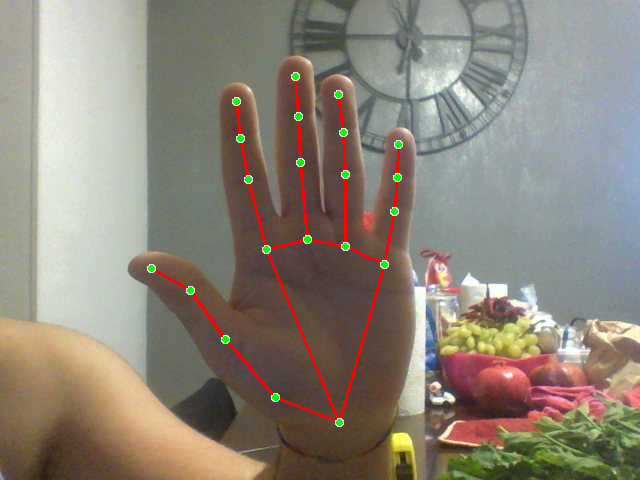
Distanza mcp-tip:
Pollice - 0.190
Indice - 0.318
Medio - 0.344
Anulare - 0.320
Mignolo - 0.254

---
## Distanza ~ 40 cm
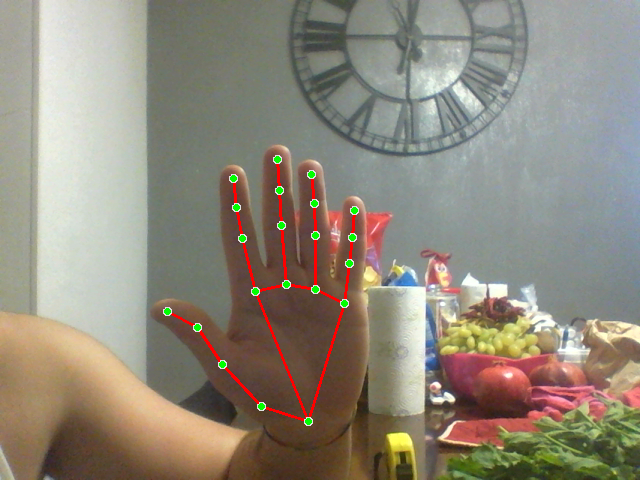
Distanza mcp-tip:
Pollice - 0.142
Indice - 0.244
Medio - 0.264
Anulare - 0.245
Mignolo - 0.196

---
## Distanza ~ 50 cm
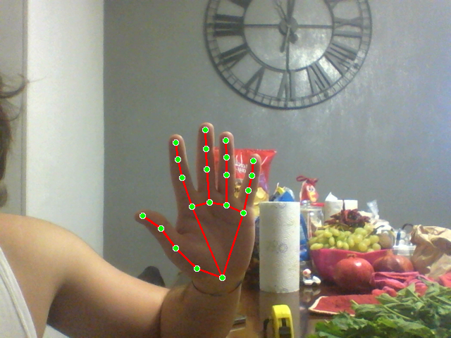
Distanza mcp-tip:
Pollice - 0.124
Indice - 0.201
Medio - 0.220
Anulare - 0.197
Mignolo - 0.160

---
## Distanza ~ 60 cm
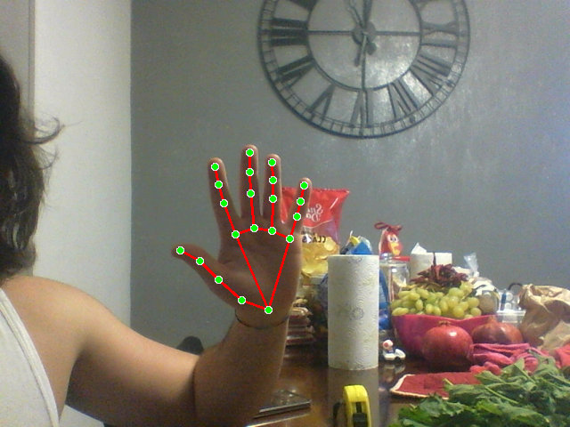
Distanza mcp-tip:
Pollice - 0.100
Indice - 0.169
Medio - 0.183
Anulare - 0.166
Mignolo - 0.131

---

## Considerazioni

| Dito    | Filtro (20-30 cm) * | Filtro (30-40 cm) | Filtro (40-50 cm) | Filtro (50-60 cm) |
| ------- | ------------------- | ----------------- | ----------------- | ----------------- |
| Pollice | 0.669               | 0.747             | 0.873             | 0.806             |
| Indice  | 0.688               | 0.767             | 0.824             | 0.841             |
| Medio   | 0.656               | 0.767             | 0.833             | 0.832             |
| Anulare | 0.665               | 0.766             | 0.804             | 0.843             |
| Mignolo | 0.698               | 0.772             | 0.816             | 0.819             |
* attenzione : il filtro 20-30 è poco indicativo poichè la rilevazione della mano (come mostrato nell'immagine) è un poco imprecisa

---

# Test 2
Questi rilevamenti sono stati effettuati con la mano aperta frontalmente alla camera, a diverse distanze, con il monitor perpendicolare al terreno e la mano tendenzialmente parallela al monitor. Il test consiste nel rilevare le distanze percepite da mediapipe per
## Distanza ~ 20 cm
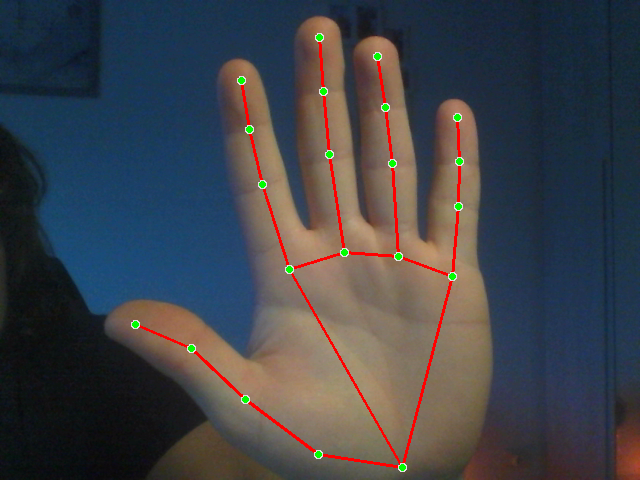 
Distanza mcp-tip: 
Pollice - 0.239 
Indice - 0.416 
Medio - 0.459 
Anulare - 0.427 
Mignolo - 0.336 

 --- 
## Distanza ~ 30 cm
 
Distanza mcp-tip: 
Pollice - 0.143 
Indice - 0.257 
Medio - 0.276 
Anulare - 0.259 
Mignolo - 0.196 

 --- 
## Distanza ~ 40 cm
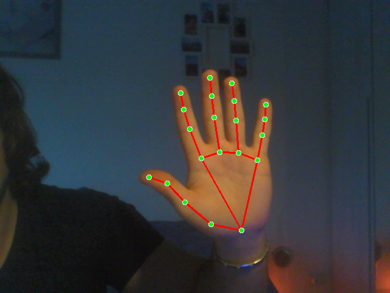 
Distanza mcp-tip: 
Pollice - 0.128 
Indice - 0.236 
Medio - 0.258 
Anulare - 0.243 
Mignolo - 0.194 

 --- 
## Distanza ~ 50 cm
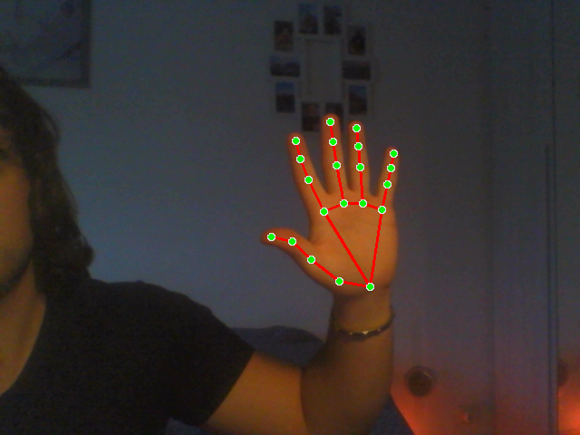 
Distanza mcp-tip: 
Pollice - 0.088 
Indice - 0.175 
Medio - 0.191 
Anulare - 0.174 
Mignolo - 0.133 

 --- 
## Distanza ~ 60 cm
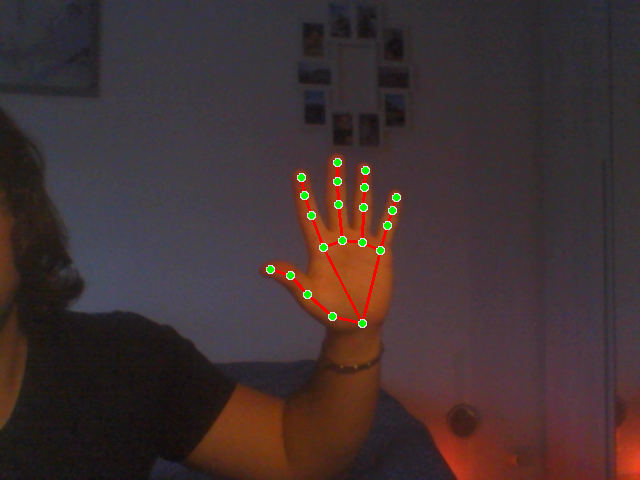 
Distanza mcp-tip: 
Pollice - 0.079 
Indice - 0.153 
Medio - 0.166 
Anulare - 0.152 
Mignolo - 0.116 

 --- 

## Considerazioni 

| Dito    | Filtro (20-30 cm) | Filtro (30-40 cm) | Filtro (40-50 cm) | Filtro (50-60 cm) |
| ------- | ----------------- | ----------------- | ----------------- | ----------------- |
| Pollice | 0.598             | 0.895             | 0.688             | 0.898             |
| Indice  | 0.618             | 0.918             | 0.742             | 0.874             |
| Medio   | 0.601             | 0.935             | 0.740             | 0.869             |
| Anulare | 0.607             | 0.938             | 0.716             | 0.874             |
| Mignolo | 0.583             | 0.990             | 0.686             | 0.872             |

---

# Test 3

## Distanza ~ 20 cm
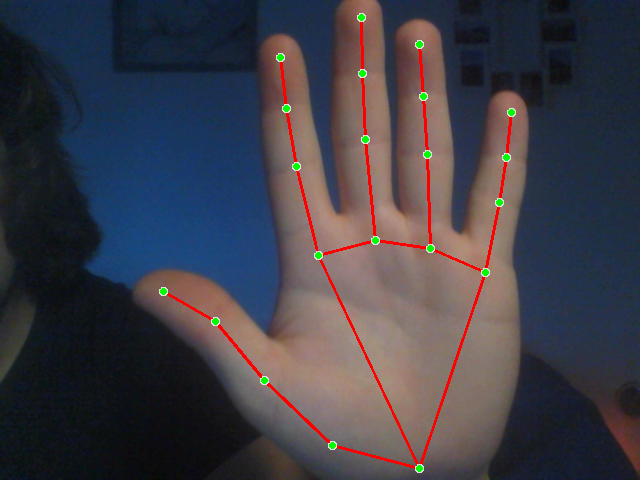 
Distanza mcp-tip: 
Pollice - 0.248 
Indice - 0.429 
Medio - 0.474 
Anulare - 0.432 
Mignolo - 0.339 

 --- 
## Distanza ~ 30 cm
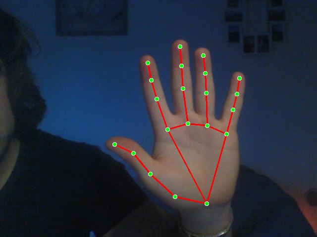 
Distanza mcp-tip: 
Pollice - 0.169 
Indice - 0.295 
Medio - 0.330 
Anulare - 0.304 
Mignolo - 0.243 

 --- 
## Distanza ~ 40 cm
 
Distanza mcp-tip: 
Pollice - 0.132 
Indice - 0.238 
Medio - 0.265 
Anulare - 0.245 
Mignolo - 0.197 

 --- 
## Distanza ~ 50 cm
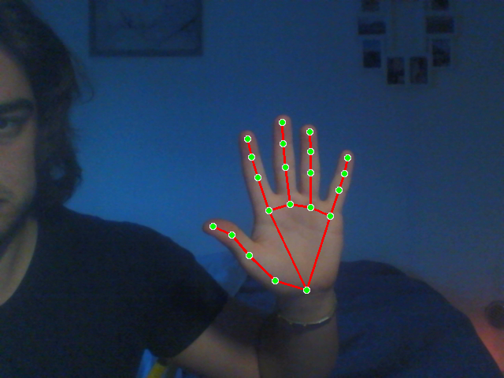 
Distanza mcp-tip: 
Pollice - 0.107 
Indice - 0.199 
Medio - 0.220 
Anulare - 0.203 
Mignolo - 0.162 

 --- 
## Distanza ~ 60 cm
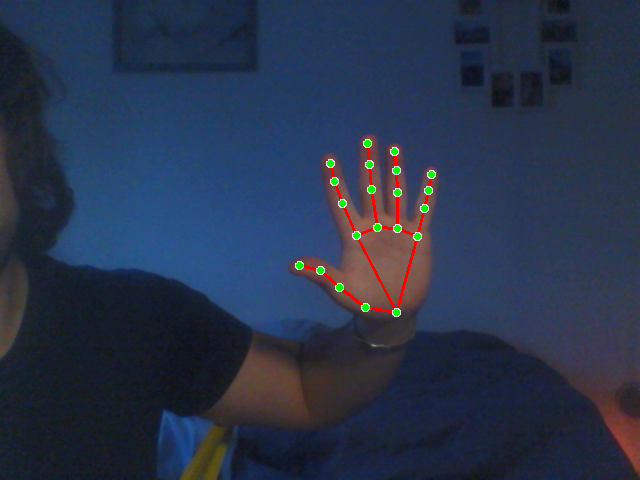 
Distanza mcp-tip: 
Pollice - 0.080 
Indice - 0.162 
Medio - 0.179 
Anulare - 0.164 
Mignolo - 0.134 

 --- 

## Considerazioni

| Dito     | Filtro (20-30 cm) | Filtro (30-40 cm) | Filtro (40-50 cm) | Filtro (50-60 cm) |
|----------|--------------------|--------------------|--------------------|--------------------|
| Pollice  | 0.681             | 0.781             | 0.810             | 0.747             |
| Indice   | 0.688             | 0.807             | 0.836             | 0.815             |
| Medio    | 0.696             | 0.803             | 0.831             | 0.814             |
| Anulare  | 0.705             | 0.805             | 0.829             | 0.807             |
| Mignolo  | 0.718             | 0.810             | 0.822             | 0.827             |

---

# Test 4

## Distanza ~ 20 cm
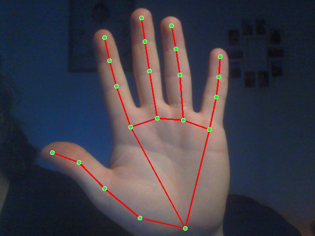 
Distanza mcp-tip: 
Pollice - 0.225 
Indice - 0.394 
Medio - 0.433 
Anulare - 0.407 
Mignolo - 0.314 

 --- 
## Distanza ~ 30 cm
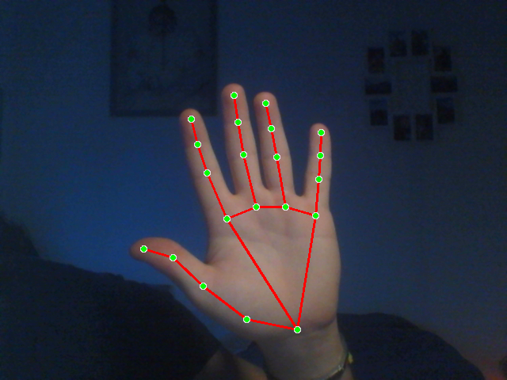 
Distanza mcp-tip: 
Pollice - 0.153 
Indice - 0.275 
Medio - 0.299 
Anulare - 0.279 
Mignolo - 0.222 

 --- 
## Distanza ~ 40 cm
 
Distanza mcp-tip: 
Pollice - 0.123 
Indice - 0.223 
Medio - 0.247 
Anulare - 0.230 
Mignolo - 0.181 

 --- 
## Distanza ~ 50 cm
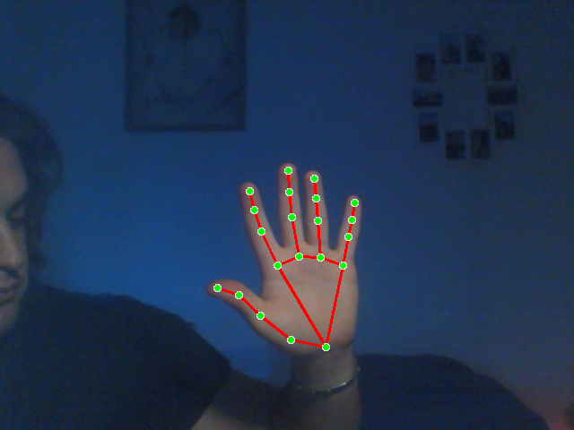 
Distanza mcp-tip: 
Pollice - 0.100 
Indice - 0.184 
Medio - 0.203 
Anulare - 0.187 
Mignolo - 0.148 

 --- 
## Distanza ~ 60 cm
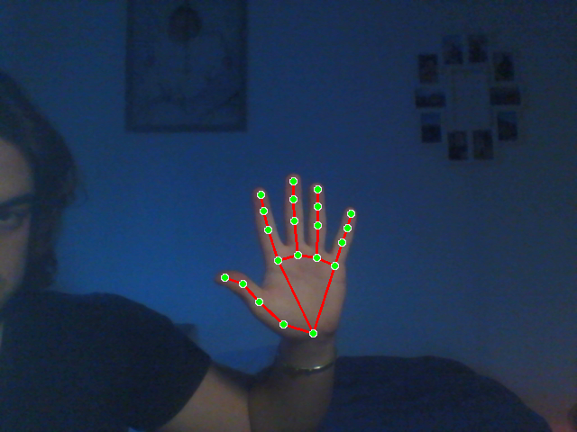 
Distanza mcp-tip: 
Pollice - 0.083 
Indice - 0.157 
Medio - 0.173 
Anulare - 0.160 
Mignolo - 0.127 

 --- 

## Considerazioni 

| Dito     | Filtro (20-30 cm) | Filtro (30-40 cm) | Filtro (40-50 cm) | Filtro (50-60 cm) |
|----------|--------------------|--------------------|--------------------|--------------------|
| Pollice  | 0.680             | 0.804             | 0.813             | 0.830             |
| Indice   | 0.698             | 0.811             | 0.825             | 0.854             |
| Medio    | 0.691             | 0.826             | 0.821             | 0.852             |
| Anulare  | 0.686             | 0.825             | 0.814             | 0.856             |
| Mignolo  | 0.707             | 0.815             | 0.818             | 0.857             |

---

# Test 5

## Distanza ~ 20 cm
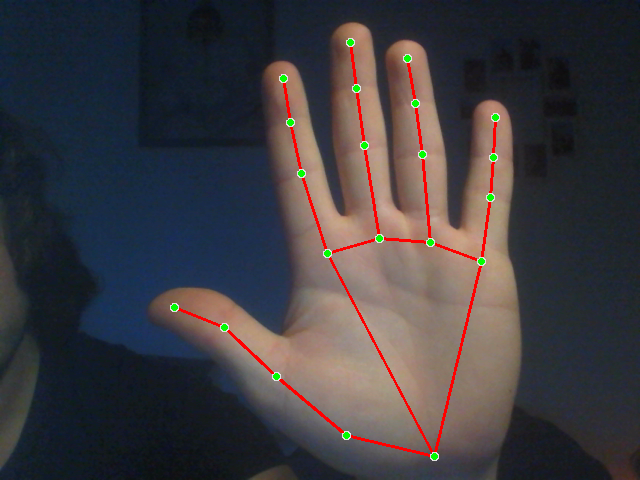 
Distanza mcp-tip: 
Pollice - 0.215 
Indice - 0.377 
Medio - 0.414 
Anulare - 0.390 
Mignolo - 0.303 

 --- 
## Distanza ~ 30 cm
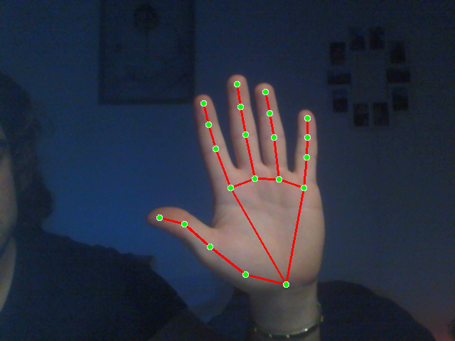 
Distanza mcp-tip: 
Pollice - 0.142 
Indice - 0.261 
Medio - 0.283 
Anulare - 0.261 
Mignolo - 0.206 

 --- 
## Distanza ~ 40 cm
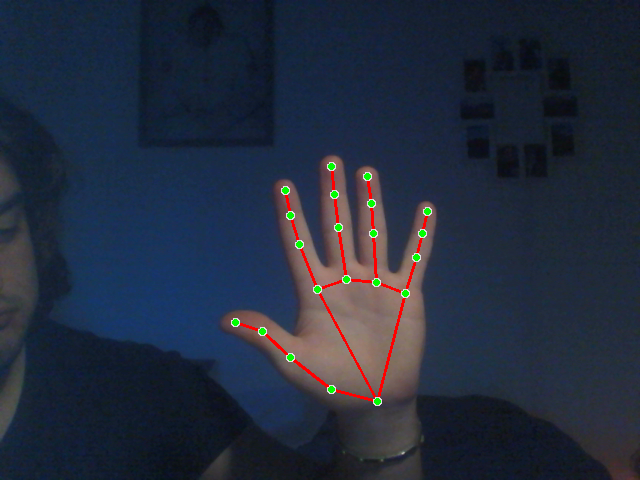 
Distanza mcp-tip: 
Pollice - 0.114 
Indice - 0.217 
Medio - 0.240 
Anulare - 0.225 
Mignolo - 0.178 

 --- 
## Distanza ~ 50 cm
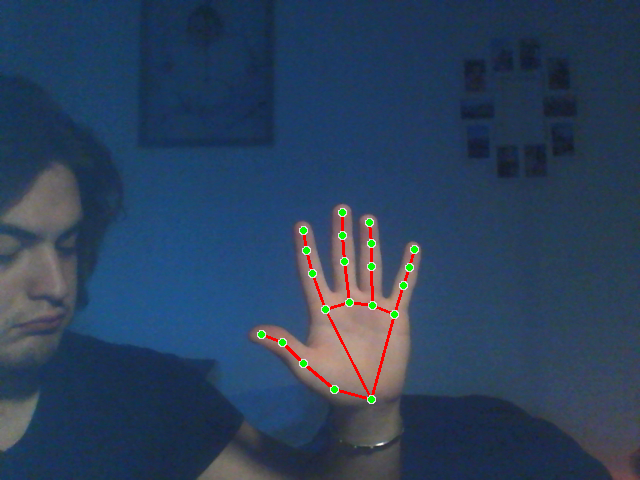 
Distanza mcp-tip: 
Pollice - 0.091 
Indice - 0.174 
Medio - 0.190 
Anulare - 0.175 
Mignolo - 0.141 

 --- 
## Distanza ~ 60 cm
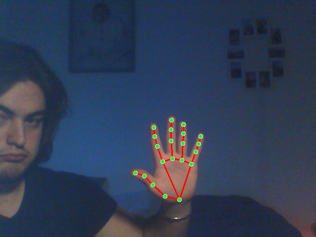 
Distanza mcp-tip: 
Pollice - 0.076 
Indice - 0.151 
Medio - 0.165 
Anulare - 0.151 
Mignolo - 0.123 

 --- 

## Considerazioni 

| Dito     | Filtro (20-30 cm) | Filtro (30-40 cm) | Filtro (40-50 cm) | Filtro (50-60 cm) |
|----------|--------------------|--------------------|--------------------|--------------------|
| Pollice  | 0.660             | 0.804             | 0.799             | 0.835             |
| Indice   | 0.692             | 0.832             | 0.802             | 0.866             |
| Medio    | 0.683             | 0.849             | 0.792             | 0.868             |
| Anulare  | 0.670             | 0.862             | 0.778             | 0.863             |
| Mignolo  | 0.679             | 0.864             | 0.792             | 0.872             |

--- 

# Test 6

## Distanza ~ 20 cm
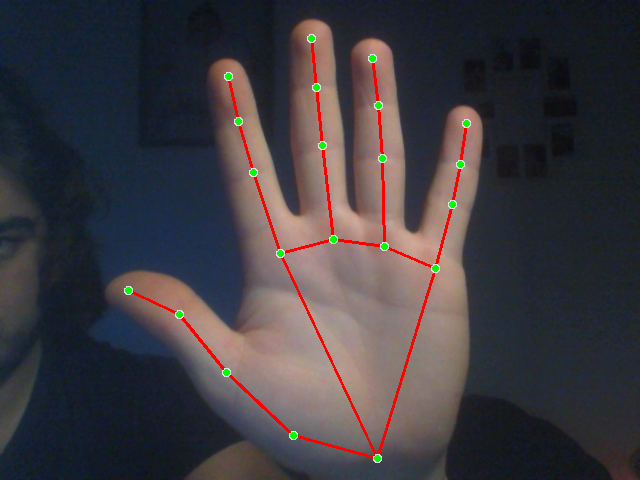 
Distanza mcp-tip: 
Pollice - 0.231 
Indice - 0.385 
Medio - 0.426 
Anulare - 0.399 
Mignolo - 0.309 

 --- 
## Distanza ~ 30 cm
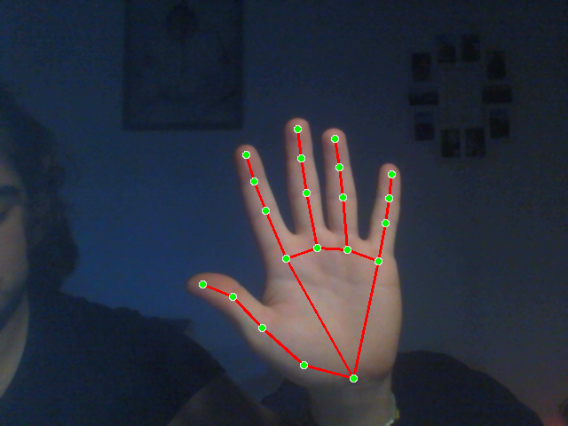 
Distanza mcp-tip: 
Pollice - 0.148 
Indice - 0.258 
Medio - 0.284 
Anulare - 0.264 
Mignolo - 0.209 

 --- 
## Distanza ~ 40 cm
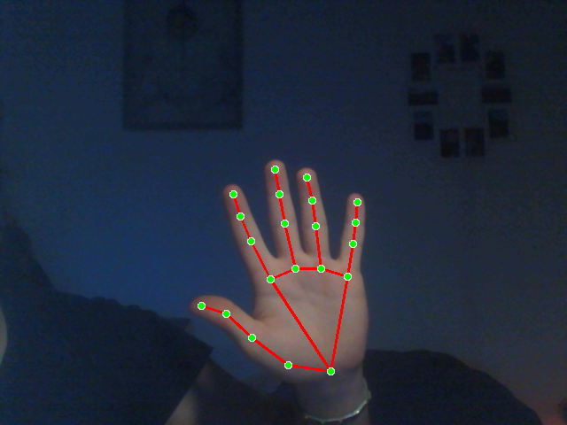 
Distanza mcp-tip: 
Pollice - 0.119 
Indice - 0.214 
Medio - 0.239 
Anulare - 0.221 
Mignolo - 0.179 

 --- 
## Distanza ~ 50 cm
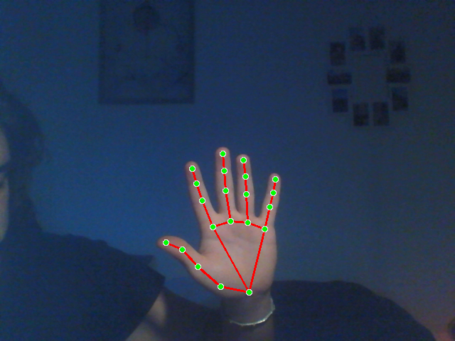 
Distanza mcp-tip: 
Pollice - 0.101 
Indice - 0.183 
Medio - 0.203 
Anulare - 0.187 
Mignolo - 0.151 

 --- 
## Distanza ~ 60 cm
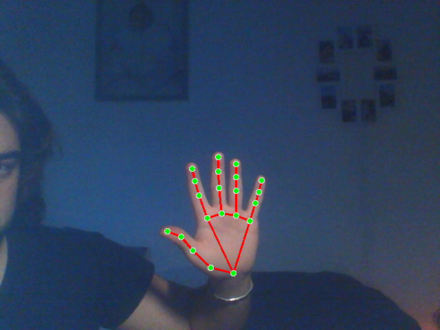 
Distanza mcp-tip: 
Pollice - 0.083 
Indice - 0.158 
Medio - 0.173 
Anulare - 0.158 
Mignolo - 0.128 

 --- 

## Considerazioni

| Dito     | Filtro (20-30 cm) | Filtro (30-40 cm) | Filtro (40-50 cm) | Filtro (50-60 cm) |
|----------|-------------------|-------------------|-------------------|-------------------|
| Pollice  | 0.641             | 0.804             | 0.849             | 0.822             |
| Indice   | 0.671             | 0.830             | 0.855             | 0.863             |
| Medio    | 0.667             | 0.841             | 0.849             | 0.852             |
| Anulare  | 0.661             | 0.837             | 0.846             | 0.844             |
| Mignolo  | 0.677             | 0.855             | 0.844             | 0.849             |

--- 